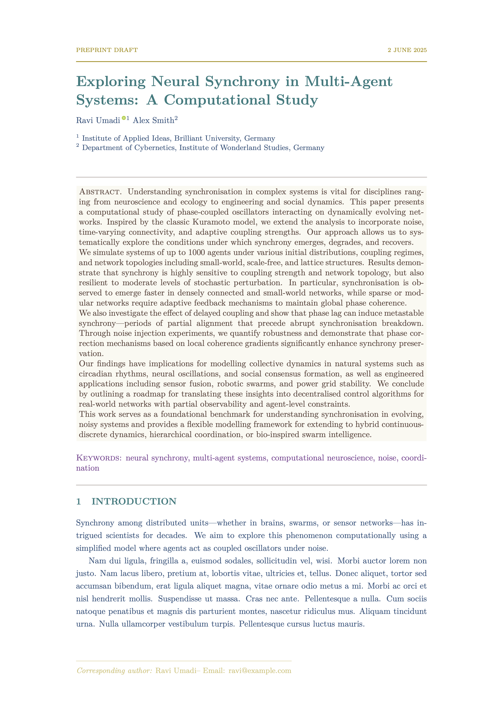

# Manuscript Modern LaTeX Class

`manuscript_modern.cls` is a flexible and elegant LaTeX class for writing scientific papers, preprints, and journal submissions with a focus on clarity, modularity, and customisation.

## ✨ Key Features

- Clean, modern typographic style
- Automatic handling of authors, ORCID, affiliations
- Optional anonymous submission mode (double-blind friendly)
- Custom colour themes for title, headings, captions, etc.
- Line numbering toggle
- Configurable front/title page
- Embedded abstract, keywords, and summary block
- Customisable reference and caption styles
- Automated personal pronouns for single/multiple authors

---

<p align="center">
  
</p>

---

## 🛠️ Getting Started

### 1. Set up your document

```latex
\documentclass{manuscript_modern}
```

### 2. Add Metadata

```latex
\title{A Modern Template for Scientific Manuscripts}
\setheaderlabel{Preprint}
\date{2 June 2025}
```

### 3. Bibliography

```latex
% Use biblatex (recommended)
\addbibresource{references.bib}
% Or load your own style
%\usepackage[style=nature]{biblatex}
```

---

## 👥 Author & Affiliation Management

Use `\addauthor` and `\addaffiliation`:

```latex
\addauthor[*]{Ravi Umadi}{0000-0003-XXXX-XXXX}{1}{ravi@example.com}
\addauthor{Alex Smith}{}{2}{alex@example.edu}
\addaffiliation{1}{Institute of Applied Ideas, Munich}
\addaffiliation{2}{School of Physics, TUM}
```

Use `[*]` to mark corresponding author. You can add any number of authors/affiliations.

---

## 🕶️ Anonymous Submission

Use `\anonymousauthor` to hide author info on the first page while keeping it on the front/title page (for journal office use):

```latex
\anonymousauthor
```

All information will still appear on `\includefrontpage`.

---

## 📄 Title Page (Optional)

To generate a clean title/front page for submissions:

```latex
\includefrontpage
```

---

## 🧾 Abstract, Summary & Keywords

```latex
\setabstract{This is the abstract. Keep it short and informative.}
\setsummary{A non-technical summary to help broader readership.}
\setkeywords{template, latex, manuscript, modern, style}
```

---

## 🎨 Custom Colour Themes

Use provided colour macros or define your own using `xcolor`.

### Predefined Colors:
- `manuscriptblue`
- `manuscriptmaroon`
- `manuscriptteal`
- `manuscriptbrown`
- `manuscriptgrey`
- `manuscriptgolden`
- `manuscriptmagenta`
- `manuscriptplum`

### Change Theme:

```latex
\settitlecolor{manuscriptteal}
\setmaintextcolor{manuscriptblue}
\setheadercolor{manuscriptgolden}
\setcaptioncolor{manuscriptbrown}
\setkeywordscolor{manuscriptplum}
```

These change section headings, main body, header/footer, captions, and keyword block respectively.

---

## 🔠 Personal Pronoun Auto-Handling

- If **1 author**: text like “we show…” is auto-converted to **“I show…”**
- If **2 or more**: remains **“we”**, **“our”**, etc.

→ Uses `\we{}`, `\our{}`, `\ours{}`, `\We{}`, `\Our{}` in your text. These commands automatically adapt.

---

## 📐 Formatting Options

### Line Numbering

```latex
\linenumbersOn  % Enable
%\linenumbersOff % Disable
```

### Main Text Block

Wrap main sections in `maintext` for better alignment:

```latex
\begin{maintext}
Your text here.
\end{maintext}
```

---

## 📊 Figures & Tables

Use `tabularx` and `booktabs` for tables:

```latex
\begin{table}
  \centering
  \caption{Example Table}
  \begin{tabularx}{0.9\textwidth}{lXr}
    \toprule
    \textbf{ID} & \textbf{Description} & \textbf{Score} \\
    \midrule
    A1 & Initial version & 8.4 \\
    B2 & Revised version & 9.2 \\
    \bottomrule
  \end{tabularx}
\end{table}
```

Use standard `\includegraphics`, `\caption` for figures. Captions automatically inherit `captioncolor`.

---

## 🧾 Footer Info & Manuscript Metadata

```latex
\setmanuscriptinfo{%
Version: Draft 1\\
Last updated: June 2, 2025\\
Git repo: \url{https://github.com/example/repo}
}
```

---

## 📚 References

```latex
\printbibliography
```

All cross-references, citations, and links inherit title color (`\@titlecolor`).

---

## 🏁 Example Usage

```latex
\maketitleblock
\begin{maintext}
\section{Introduction}
This is our project.
We used \we{} and \our{} to indicate collective authorship.
\end{maintext}
```

---

## 📦 Install Class System-Wide

To install globally (e.g., `/usr/local/texlive/texmf-local/tex/latex/manuscript_modern/`):

```bash
sudo mkdir -p /usr/local/texlive/texmf-local/tex/latex/manuscript_modern
sudo cp manuscript_modern.cls /usr/local/texlive/texmf-local/tex/latex/manuscript_modern/
sudo mktexlsr
```

To update, just overwrite the `.cls` and run `mktexlsr` again.

---

## 📄 License

Creative Commons Attribution-NonCommercial 4.0 International (CC BY-NC 4.0)

---

## 💬 Feedback / Contributions

Feel free to fork and contribute on [GitHub](git@github.com:raviumadi/manuscript.git) or raise an issue. If you use the template in a published/preprint work, I’d love to know!

---

Enjoy writing beautifully 🌿
